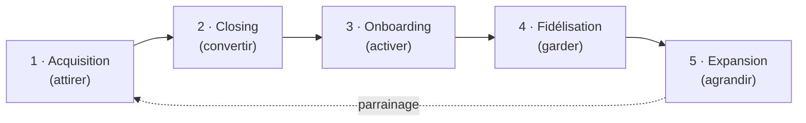

# 🧭 Stratégie commerciale Tolkee — vision globale

> Doc de référence « Head of Sales ». Vue schématisée des **5 piliers** qui font
> grandir l'activité, et de l'ordre dans lequel les construire.
> Détail de l'acquisition : [[Acquisition|→ Acquisition]].

---

## ⚠️ Phase actuelle : POC gratuits (collecte de feedback)

Avant toute lecture : on n'est **pas** en phase « vendre / encaisser ».
L'objectif n°1 aujourd'hui est de **placer le produit chez 5–10 PME en POC
gratuit pour récolter des retours utilisateurs** et affiner le produit + le pitch.

Conséquence sur tout ce qui suit :
- Le « ask » n'est pas « signez », c'est **« testez gratuitement et dites-moi »**.
- La métrique reine n'est pas le CA, c'est le **nombre de POC actifs + qualité du feedback**.
- Les piliers 2 à 5 (Closing → Expansion) sont **réels mais en sommeil** : on les
  réveille une fois les POC concluants. On ne fidélise pas des clients qu'on n'a pas.

> **Ce qui est démontrable aujourd'hui (juillet 2026)** — le produit couvre les trois
> actes de la démo : **Analyser** (l'appel se note seul → note, tâches « À faire »,
> next steps), **Piloter** (vue Deals, momentum, hygiène de pipeline, exit-criteria,
> fiabilité du forecast) et **Coacher** (alerte de décrochage, « Préparer un 1:1 »,
> profil de coaching). Sources : Ringover, Aircall, Google Meet. CRM : HubSpot **et**
> Pipedrive. Conducteur de démo : [[antiseche-demo|→ Antisèche démo]].

---

## 🗺️ Le tunnel de revenu (les 5 piliers)

```
   ATTIRER          CONVERTIR         ENCAISSER         GARDER         AGRANDIR
 ┌──────────┐    ┌────────────┐    ┌──────────┐    ┌────────────┐   ┌──────────┐
 │   1.     │ →  │     2.     │ →  │    3.    │ →  │     4.     │ → │    5.    │
 │ ACQUIS.  │    │  CLOSING   │    │ ONBOARD. │    │ FIDÉLIS.   │   │ EXPANSION│
 └──────────┘    └────────────┘    └──────────┘    └────────────┘   └──────────┘
  "on me        "le prospect      "le client      "il reste,      "il paie
   connaît"      dit oui"          réussit vite"    il renouvelle"  plus"
       │              │                 │                │              │
   RDV / POC       Taux de           Time-to-          Taux de       Net Revenue
   obtenus         conversion        value (TTV)       rétention     Retention
```



**Règle d'or :** on ne muscle jamais le haut du tunnel tant que le bas fuit.
On construit **de droite à gauche** (3-4-5 solides), puis on ouvre le robinet (1-2).
En phase POC, concrètement : **Acquisition + Onboarding** sont les deux chantiers vivants.

---

## 1. 🎯 Acquisition — générer attention et rendez-vous

**Objectif :** remplir le pipeline de PME FR équipées Ringover/Aircall, prêtes à tester.

**Chantiers**
- ICP figé + critères de ciblage → [[Acquisition|détail complet ici]].
- Canaux gratuits : **outbound ciblé** (70 %), **partenaire Ringover/Aircall** (20 %),
  **contenu founder LinkedIn** (10 %).
- Le message : angle de diff (RGPD + téléphonie FR + « sans embaucher de Head of Sales »),
  et en phase POC → offre de test gratuit.

**Métrique clé :** **POC démarrés / semaine** (et RDV qualifiés en amont).

---

## 2. 🤝 Closing — transformer l'intérêt en engagement

> En phase POC, « closing » = **obtenir un OUI pour tester**, pas une signature.
> Le vrai closing payant viendra après les premiers retours.

**Objectif :** faire passer du « intéressant » au « ok je teste / je paie ».

**Chantiers**
- **Démo qui fait mal puis soulage** : montrer l'appel raté qui a coûté un deal,
  puis ce qu'Tolkee en aurait dit. Pas une visite guidée de features.
- **Cadre du POC** : durée (ex. 1 mois), ce qu'on attend du client (brancher sa
  téléphonie + un call de feedback), ce qu'il obtient (analyses + coaching).
- **Objections à scripter** : « pas le temps », « RGPD ? », « mes commerciaux vont
  se sentir fliqués ».
- Plus tard : pricing (~500 €/mois), devis, paiement Stripe.

**Métrique clé :** **taux de conversion** (RDV → POC, puis POC → client payant).

---

## 3. 🚀 Onboarding — le client réussit en 7 jours

> Pilier le plus négligé par les fondateurs, et celui qui tue le plus de SaaS.
> **Critique dès le 1er POC** : un POC où le client ne voit rien = feedback inutile.

**Objectif :** amener au premier « ah, je vois ! » le plus vite possible
(brancher Ringover → 1er appel transcrit → 1ère analyse → 1ère alerte coaching).

**Chantiers**
- Parcours d'activation fluide : l'onboarding assisté IA et la connexion CRM (HubSpot/Pipedrive) sont
  livrés → le chantier restant est surtout de **rôder ce parcours sur de vrais comptes** (branchement
  téléphonie réelle vs simulateur).
- Définition du **« client activé »** (ex. *téléphonie connectée ET 3 analyses consultées*).
- Aide au démarrage : guide, vidéo 3 min, ou call de setup avec toi.

**Métrique clé :** **Time-to-Value** (jours entre OUI et 1ère valeur perçue).

---

## 4. 💚 Fidélisation — il reste et renouvelle

**Objectif :** usage hebdomadaire réel, jamais l'envie de partir.

**Chantiers**
- **Usage = survie** : suivre qui se connecte, repérer le décrochage (= churn à 60 j).
- **Rituels de valeur** : récap hebdo « voici ce que ton équipe a amélioré ».
- **Boucle de feedback** : parler aux partants (*pourquoi ?*) et aux fans (*pourquoi ?*).

**Métrique clé :** **taux de rétention** (inverse : churn mensuel).

---

## 5. 📈 Expansion — le client paie plus avec le temps

**Objectif :** faire grossir chaque compte.

**Chantiers**
- **Upsell** : +commerciaux → +sièges.
- **Cross-sell** : les modules Piloter (hygiène de pipeline, forecast) et Coacher (1:1, profil de coaching)
  existent déjà → levier de montée en gamme une fois le socle Analyser adopté.
- **Parrainage** : un client content en ramène un autre (acquisition la moins chère).

**Métrique clé :** **Net Revenue Retention**.

---

## 🧭 Ordre de priorité (stade actuel)

| Priorité | Pilier | Pourquoi maintenant |
|---|---|---|
| **1** | Acquisition (juste assez) | Besoin de **5–10 POC**, pas de 100 clients. |
| **2** | Onboarding | Un POC ne sert que si le client voit la valeur vite. |
| **3** | Closing (version POC) | Affiner le pitch en parlant à de vrais prospects. |
| 4–5 | Fidélisation / Expansion | Plus tard : pas de fidélisation sans clients. |

**Job de Head of Sales au stade MVP :** vendre toi-même à la main les premiers POC,
et traiter chaque appel comme une session de R&D produit.

---

🔗 Suite : [[Acquisition]] · contexte produit : [[architecture/Carte-globale|Carte d'architecture]]
