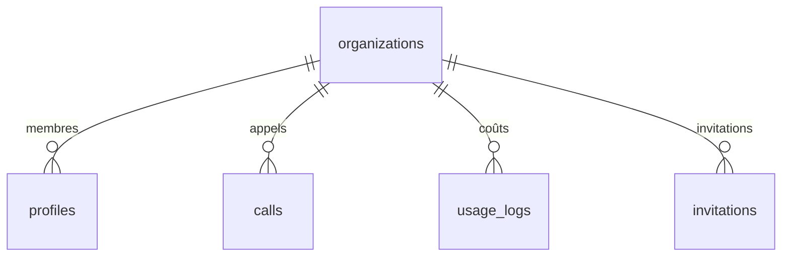

↑ [[Carte-globale]]

# 🗄️ Table `organizations`

La **racine du tenant** : 1 org = 1 compte client Tolkee. Tout (appels, membres,
coûts) est rattaché à une org.

[[Base-profiles|→ profiles]] · [[Base-calls|→ calls]] · [[Base-usage_logs|→ usage_logs]] · [[Base-invitations|→ invitations]]

## Colonnes

| Colonne | Type | Rôle |
|---|---|---|
| `id` | uuid (PK) | Identifiant de l'org. |
| `name` | text | Nom de l'entreprise cliente. |
| `slug` | text (unique) | Identifiant lisible. |
| `stripe_customer_id` | text | Client Stripe. |
| `stripe_subscription_id` | text | Abonnement Stripe. |
| `subscription_status` | text | `trial` / `active` / `past_due` / `canceled`. |
| `subscription_plan` | text | `starter` / `growth` / `scale`. |
| `trial_ends_at` | timestamptz | Fin de l'essai (14 jours). |
| `logo_url` | text | Logo de l'org. |
| `ai_profile` | jsonb | Profil IA (contexte métier injecté dans le prompt Claude). |
| `ringover_account_id` | text | Compte Ringover → sert à **dériver l'org** d'un appel réel signé. |
| `ringover_api_key` | text | 🔒 Clé API Ringover — **chiffrée au repos** (AES-256-GCM). |
| `hubspot_token` | text | 🔒 Token HubSpot — **chiffré au repos**. |
| `hubspot_portal_id` | text | Portail HubSpot du client. |
| `created_at` / `updated_at` | timestamptz | Horodatage. |

## Sécurité

- `ringover_api_key` et `hubspot_token` sont **chiffrés** via `lib/crypto/org-secrets.ts`
  (clé `ORG_SECRETS_ENC_KEY`). Migration 0017 les protège. Voir [[Securite]].
- Le webhook Ringover **ignore** l'`organization_id` du body et dérive l'org à partir
  de `ringover_account_id` (anti-usurpation de tenant). Voir [[Pipeline-appel]].

## Qui écrit / lit

- **Écrit** : trigger de signup (création auto), webhooks Stripe (abonnement),
  réglages dashboard (intégrations, profil IA).
- **Lit** : tout le pipeline (plan, secrets) + le dashboard.
