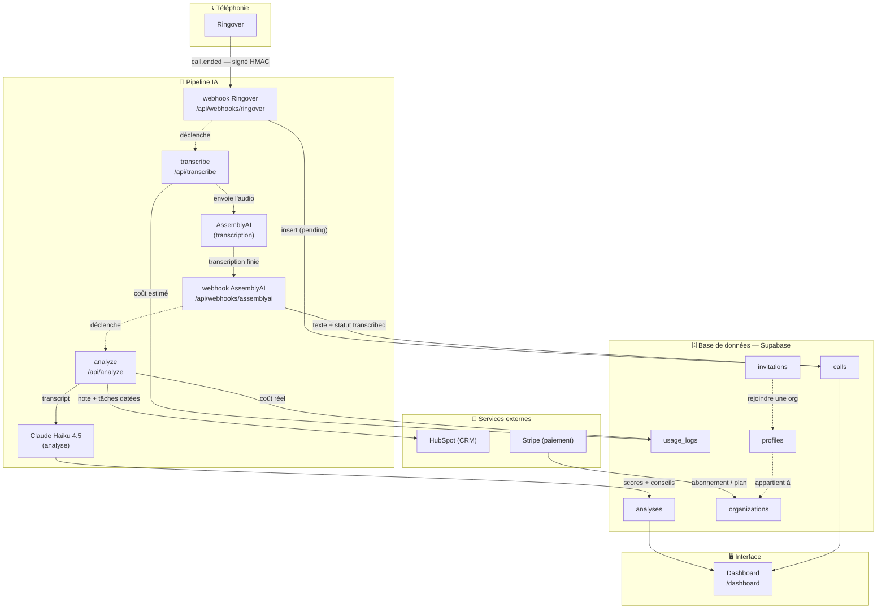
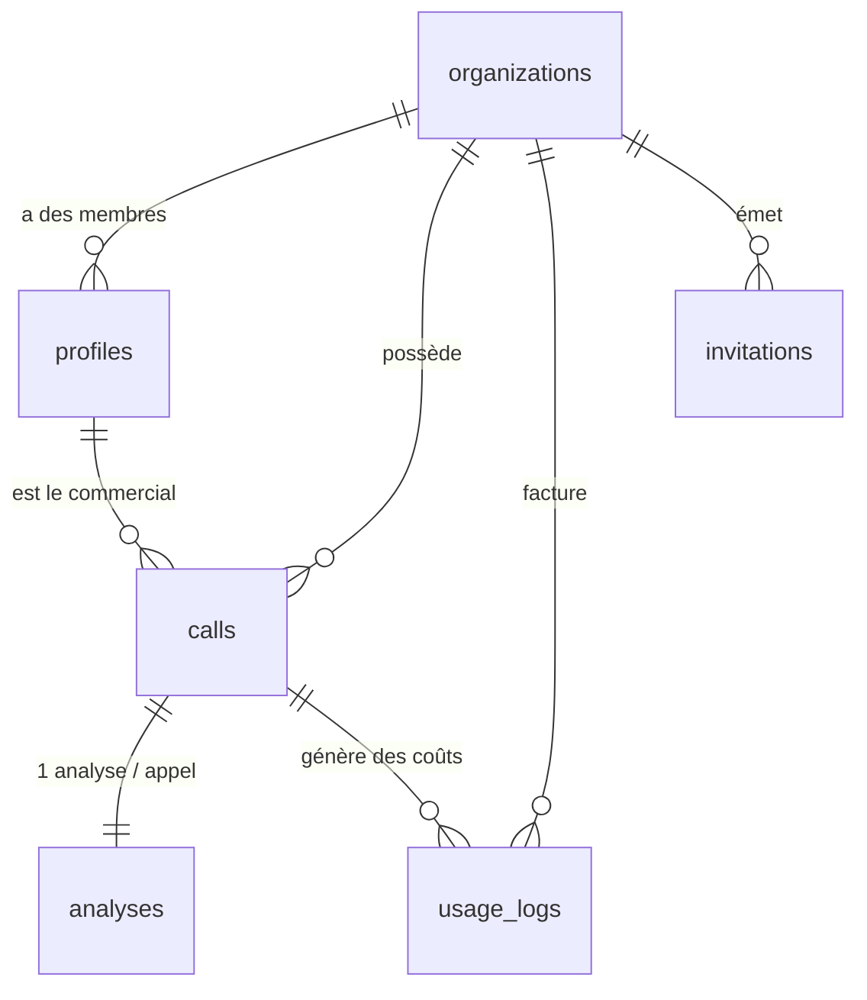

# 🗺️ Carte globale — Tolkee

Vue d'ensemble du système. **Clique une boîte** pour zoomer (ou utilise la liste sous le schéma).

### 🔎 Zoomer (liste de secours si le clic-boîte ne marche pas)

- **Le voyage d'un appel** → [[Pipeline-appel]]
- **Sécurité & secrets** → [[Securite]]
- Bases : [[Base-calls]] · [[Base-analyses]] · [[Base-organizations]] · [[Base-profiles]] · [[Base-usage_logs]] · [[Base-invitations]]

---

## Comment lire ce schéma

- **Flèche pleine `→`** = une donnée est écrite/transmise.
- **Flèche pointillée `-.->`** = un déclenchement (une étape en lance une autre).
- Un **appel** entre par Ringover, traverse le **pipeline IA** (transcription puis
  analyse), et ressort en **scores + conseils** affichés sur le dashboard et poussés
  dans HubSpot. Chaque étape payante est tracée dans `usage_logs`.

## Relations entre les bases (vue rapide)

*Chaque table : voir sa note dédiée pour le détail des colonnes.*
