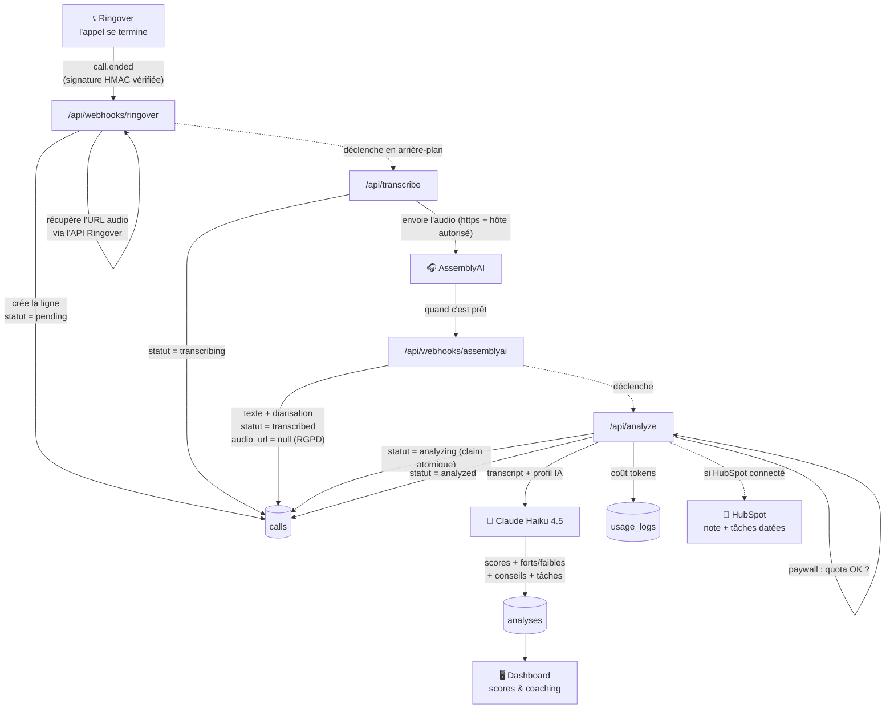

↑ [[Carte-globale]]

# 🤖 Le voyage d'un appel (pipeline)

De la fin d'un appel téléphonique jusqu'aux conseils affichés. Chaque étape change
le **statut** de l'appel dans la table [[Base-calls|calls]] :
`pending → transcribing → transcribed → analyzing → analyzed` (ou `failed`).

### 🔎 Zoomer

- Table [[Base-calls|calls]] (le statut, le transcript) · Table [[Base-analyses|analyses]] (les scores)
- Table [[Base-usage_logs|usage_logs]] (les coûts) · [[Securite|Sécurité & secrets du pipeline]]

---

## Les garde-fous importants (anti-doublon, anti-fuite)

| Garde-fou | Où | Pourquoi |
|---|---|---|
| **Signature HMAC** | webhook Ringover | Refuse tout appel non signé (`fail-closed`). |
| **Secret interne** `x-tolkee-internal` | `/api/transcribe`, `/api/analyze` | Ces routes écrivent en bypass RLS → appelées **que** par nos webhooks. |
| **Allowlist d'hôtes audio** | `/api/transcribe` | AssemblyAI ne fetch qu'un hôte autorisé (anti-SSRF). |
| **Secret webhook AssemblyAI** | webhook AssemblyAI | On vérifie qu'AssemblyAI nous renvoie bien notre secret. |
| **Idempotence (upsert)** | webhook Ringover | Un même `call.ended` rejoué ne crée pas de doublon ni de transcription payante. |
| **Claim atomique** | transcribe & analyze | `update ... where status = X` : la 1ʳᵉ invocation gagne, les doublons s'arrêtent. |
| **Paywall** | `/api/analyze` | On bloque **avant** d'appeler Claude si le quota du plan est atteint. |
| **Purge audio** | webhook AssemblyAI | `audio_url = null` après transcription : on ne garde que le texte (RGPD). |

## Mode simulation (démo / dev)

En dev (et preview Vercel), `/dev/test` injecte un faux transcript : le pipeline
**saute AssemblyAI** (coût 0) et passe direct de `pending` → `transcribed` → analyse.
Désactivé en production (sauf `ALLOW_DEV_SIMULATE=1` pour une démo ponctuelle).
Détail des secrets : [[Securite]].
