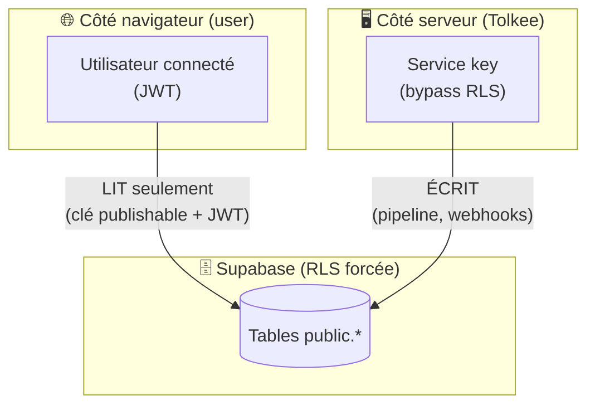
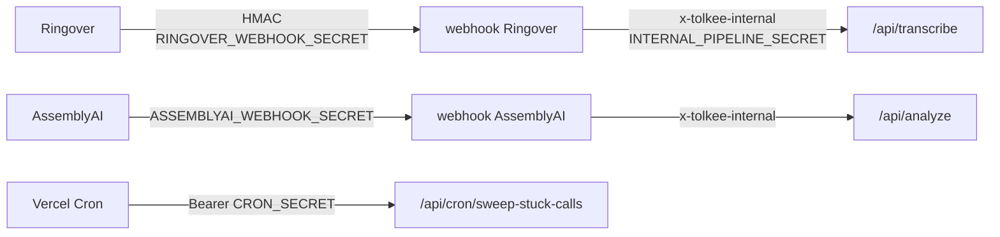

↑ [[Carte-globale]]

# 🔐 Sécurité — qui peut lire/écrire quoi

Deux principes : **RLS** (la base filtre par org) et **secrets** (qui a le droit
d'appeler quoi). Source de vérité : `AGENTS.md` + `supabase/migrations/`.

## Le modèle de lecture / écriture

- **Les users LISENT** avec la clé publishable + leur JWT — la RLS ne leur montre
  que **leur** org (`user_organization_id()`).
- **Le serveur ÉCRIT** avec la `SUPABASE_SECRET_KEY` (bypass RLS) : c'est le pipeline
  et les webhooks qui écrivent, jamais le navigateur directement.
- **RLS activée ET forcée** sur toutes les tables `public.*` (migration 0022).

## Les secrets qui protègent le pipeline

| Secret | Protège | Comportement si absent |
|---|---|---|
| `RINGOVER_WEBHOOK_SECRET` | webhook Ringover (HMAC) | **Fail-closed** : tout rejeté (401). |
| `ASSEMBLYAI_WEBHOOK_SECRET` | webhook AssemblyAI | **Fail-closed** : 401. |
| `INTERNAL_PIPELINE_SECRET` | `/api/transcribe`, `/api/analyze` | **Fail-closed** : 401 → pipeline cassé. |
| `CRON_SECRET` | crons (sweep, purge audio, spend-alert) | **Fail-closed** : 401 → cron ne tourne pas. |
| `ORG_SECRETS_ENC_KEY` | chiffre `ringover_api_key` + `hubspot_token` | Toute (dé)chiffrement échoue → pipeline cassé. |
| `HUBSPOT_APP_CLIENT_SECRET` | signature v3 de la carte HubSpot | Carte non vérifiée. |

> 🔒 **Règle d'or** : les clés `NEXT_PUBLIC_*` sont safe côté navigateur. **Toutes les
> autres** (`*_SECRET_KEY`, `ANTHROPIC_API_KEY`…) sont **server-only** — jamais exposées
> au client. `.env.local` n'est **jamais** committé.

## Données & RGPD

- Données utilisateurs **en Europe** (Supabase Paris, AssemblyAI EU).
- **Audio purgé** après transcription (`audio_url = null`) — on ne garde que le texte.
- Profils détachés supprimés **90 jours** après `removed_at` (voir [[Base-profiles]]).
- Secrets tiers **chiffrés au repos** (AES-256-GCM) — voir [[Base-organizations]].

## Pour aller plus loin

- Le voyage d'un appel et ses gardes : [[Pipeline-appel]]
- Les tables et leur RLS : [[Base-calls]], [[Base-organizations]], [[Base-profiles]]
